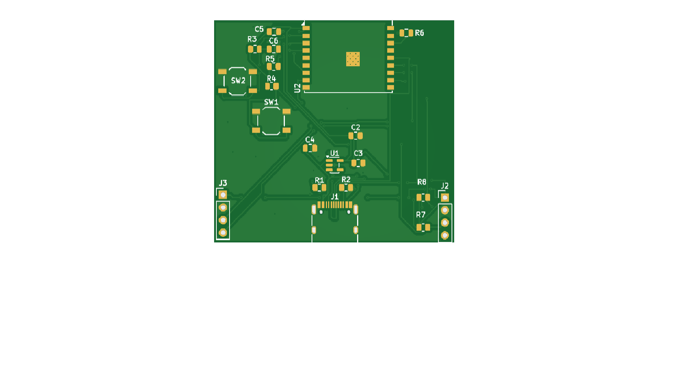

# ESP32-C3 Environmental Monitoring Station

Dvoslojna PCB za mjerenje temperature, vlage, tlaka, CO2 i
cestica. Prvi vlastiti PCB dizajn.

## Hardver
- ESP32-C3-WROOM-02
- AP2112K-3.3 LDO, napajanje preko USB-C
- I2C header (BME280, SCD40)
- UART header (PMS5003)
- Boot i reset tipke

## Status
Rev A - dizajn zavrsen, DRC cist, ploca jos nije proizvedena.

## Alati
KiCad 10
